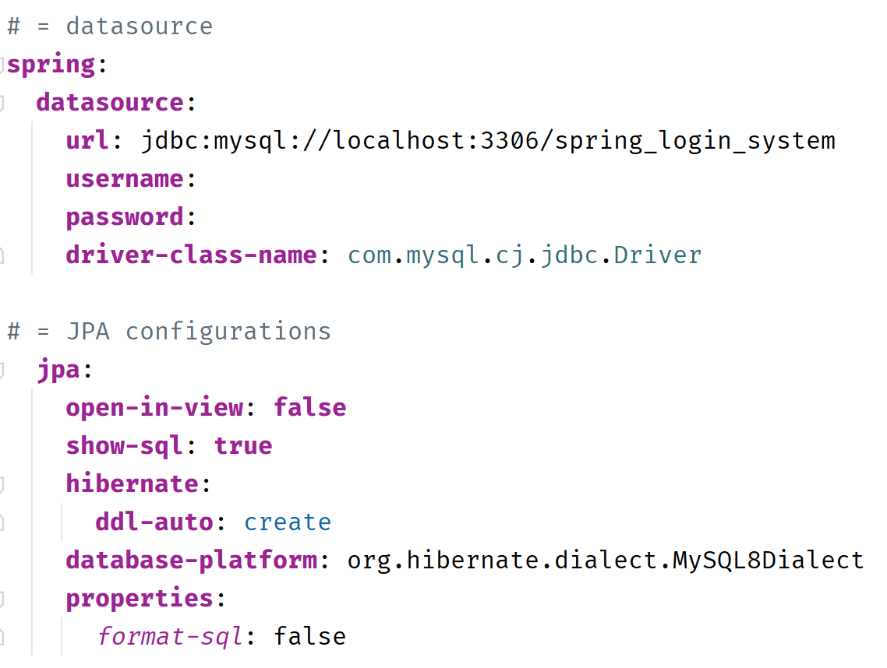

# Modern Login System Project
## Project

The *ModernLoginSystemProject* project is a web application developed using the Spring Boot framework. It demonstrates controlled access to resources based on user roles. Users can identify themselves in the system, and administrators can manage their roles and update their passwords. There is also the ability to recover forgotten passwords. To test the project, run it in a local environment. After launching the project, open the following link in your browser: http://localhost:8080.

---

---

**Project Structure:**

The project includes various packages and classes for better organization and code support.

*Main project components:*

**model:** A package containing data models, such as users and objects associated with the system entity.

**DTO:** A package containing Data Transfer Objects used for exchanging information between different system components.

**repository:** A package containing interfaces and classes for interacting with the database through JPA.

**service:** A package containing business logic and services, such as registration service, password recovery service, and CRUD operations.

**constraint:** Constraints and validation, including confirmation of re-entered email and password.

**controller:** A package containing controllers that handle HTTP requests for displaying public pages, protected pages for each role, and handling forgotten passwords.

**security:** A package containing security settings, including role-based access configuration.

**exception:** A package containing exception handlers for exceptions that may occur during user actions.

---

---

### Execution

The project offers users the following functionality:

*User Authentication and Password Recovery:*
- Users can sign in to the system with a unique email address and password.
- Password requirements include the presence of digits, different cases, and special characters.
- The system uses an email service to send a temporary token for password reset.
- A unique token with a limited expiration is generated and sent in an email with a password reset link.

---

---

*Roles and Security Settings:*
- The project uses a role system to restrict user access.
- Security settings determine which roles have access to different parts of the web interface.
- Each user is assigned a role: ADMIN, MODERATOR, or STUDENT.
- ROLE_ADMIN: Full access to all resources and user management capabilities.
- ROLE_MODERATOR: Limited access and specific user management with ROLE_STUDENT.
- ROLE_STUDENT: Limited access for viewing.

*User Creation and Display:*
- The system allows registering a new user, specifying their name, surname, email, and password.
- When creating a user, their role is automatically set to ROLE_STUDENT.
- If the ROLE_STUDENT role is absent, it is created.
- ADMIN can create, edit, and delete users.
- Display of messages for successful or unsuccessful user actions is implemented.
- Checking for email duplication during addition or update.
- By default, the system already has one user of each role.

*User Access:*
- Created public and protected pages, as well as pages specific to each defined role.
- Users with the "ADMIN" role have access to all resources starting with "/admin".
- Users with roles "MODERATOR" or "ADMIN" have access to all resources starting with "/moderator".
- Users with roles "STUDENT" or "MODERATOR" have access to all resources starting with "/student".
- Authorized users can view their status and get information about their role.

*Structured Interface Section:*
- After a successful login, the user is directed to a page displaying role differentiation.
- On this page, the user is offered to choose their role through corresponding buttons.
- Choosing a role leads to redirection to a page specific to that role.
- If the user selects a button that does not match his role, it will be redirected to the Access Denied page.

---

---

#### The "Modern Login System Project" demonstrates how Spring Boot allows developers to quickly and easily create a secure login system based on the productive Spring class. This ensures the implementation of modern security approaches and user management. The system is well-structured, and the interface provides convenient and clear access to functionality for different user roles.
