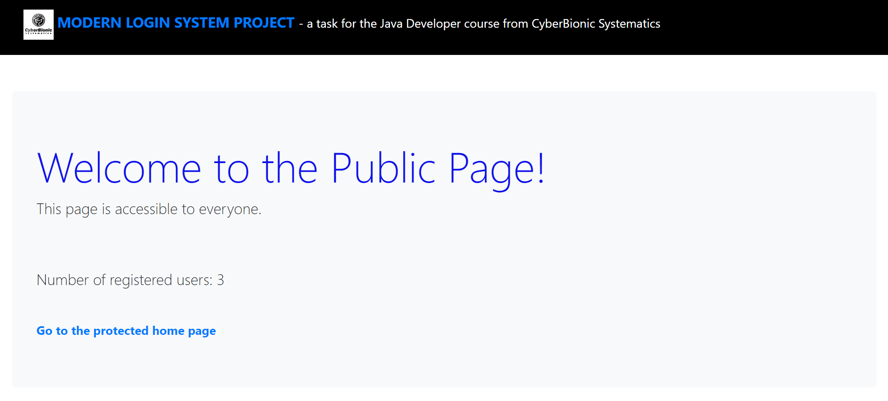
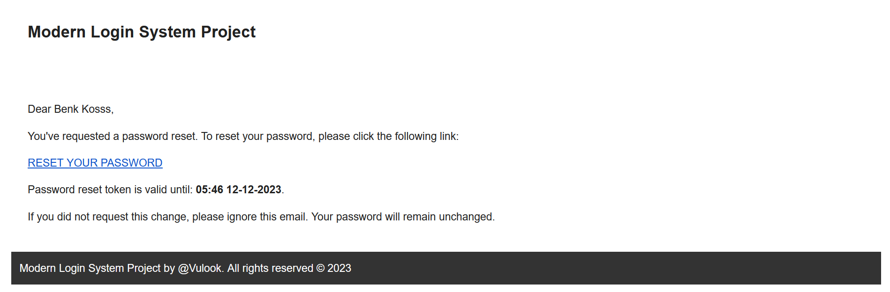
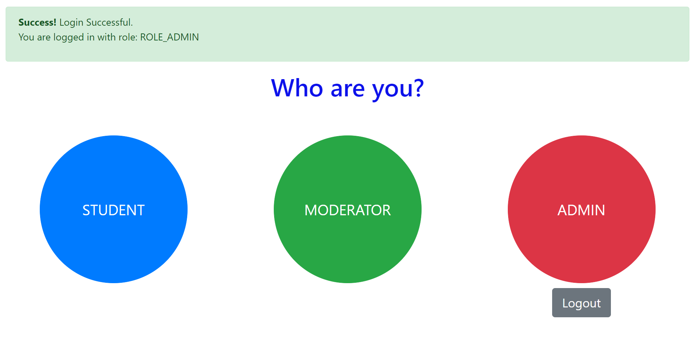

# Modern Login System Project
## Проєкт

Проєкт *ModernLoginSystemProject* - це вебдодаток, розроблений з використанням технології Spring Boot, який демонструє контрольований доступ до ресурсів в залежності від ролі користувача. При цьому користувачі можуть ідентифікуватися в системі, а адміністратор – може управляти їхніми ролями та оновлювати їхні паролі. Також є можливість відновити забутий пароль. Щоб протестувати проєкт, запустіть його в локальному середовищі. Після запуску проєкту відкрийте в браузері посилання http://localhost:8080.

---

---

**Структура проєкту:**

Проєкт містить різні пакети та класи для кращої організації та підтримки коду. 

*Основні компоненти проєкту:*

**model:** пакет, що містить моделі даних, такі як користувачі та об'єкти, що пов'язані із сутністю системи.

**DTO:** пакет, що містить об'єкти передачі даних для обміну інформацією між різними компонентами системи.

**repository:** пакет, що містить інтерфейси та класи для взаємодії з базою даних через JPA.

**service:** пакет, що містить бізнес-логіку та сервіси, такі як сервіс реєстрації, сервіс відновлення пароля та CRUD операції.

**constraint:** обмеження та валідація, зокрема, підтвердження (to confirm) повторного введення email та паролю.

**controller:** пакет, що містить контролери, які обробляють HTTP-запити для відображення публічної сторінки, захищених сторінок для кожної ролі та обробку забутого пароля.

**security:** пакет, що містить налаштування безпеки, включаючи конфігурацію доступу за ролями.

**exception:** пакет, що містить обробники винятків, які виникають в процесі дій користувача.

---

---

### Виконання

Проєкт пропонує користувачам наступний функціонал:

*Автентифікація користувачів та відновлення пароля:*
- користувач може ідентифікуватися в системі, використовуючи унікальний email та пароль.
- вимоги до пароля включають наявність цифр, різних регістрів латинських букв та спецсимволів.
- використовується сервіс електронної пошти для надсилання тимчасового токена для скидання пароля.
- генерується унікальний токен з обмеженим терміном дії, та надсилається лист з посиланням на відновлення пароля.

---

---

*Ролі та налаштування безпеки:*
- проєкт використовує систему ролей для обмеження доступу користувачів до системи.
- налаштування безпеки визначає, які ролі мають доступ до різних частин вебінтерфейсу.
- кожен користувач має призначену роль: ADMIN, MODERATOR або STUDENT.
- ROLE_ADMIN: Має повний доступ до всіх ресурсів та можливість управління користувачами.
- ROLE_MODERATOR: Має обмежений доступ та здійснює визначене управління користувачами з роллю ROLE_STUDENT.
- ROLE_STUDENT: Обмежений доступ для перегляду.

*Створення користувача та відображення:*
- система дозволяє реєструвати нового користувача, задаючи його ім'я, прізвище, email та пароль.
- при створенні нового користувача для нього автоматично визначається його роль як ROLE_STUDENT.
- якщо роль "ROLE_STUDENT" відсутня, вона створюється.
- ADMIN має можливість створювати, редагувати та видаляти користувачів.
- реалізовано відображення повідомлень про успішні дії користувача або невдачу.
- виконана перевірка на дублювання email при додаванні або оновленні користувача.
- по замовчуванню в системі вже створено по одному користувачу кожної ролі.

*Доступ користувачів:*
- створено публічну та захищену сторінки, а також сторінки для кожної визначеної ролі.
- користувачі з роллю "ADMIN" мають доступ до всіх ресурсів, які починаються з "/admin".
- користувачі з ролями "MODERATOR" або "ADMIN" мають доступ до всіх ресурсів, які починаються з "/moderator".
- користувачі з ролями "STUDENT" або "MODERATOR" мають доступ до всіх ресурсів, які починаються з "/student".
- авторизовані користувачі можуть переглядати свій статус та отримувати інформацію про свою роль.

*Структурована інтерфейсна частина:*
- після успішного входу користувач потрапляє на сторінку, яка відображає розмежування за роллю.
- на цій сторінці користувачеві пропонуються вибрати свою роль через відповідні кнопки.
- вибір ролі веде до перенаправлення на сторінку, специфічну для цієї ролі.
- якщо користувач обере кнопку, яка не відповідає встановленому доступу - він буде перенаправлений на сторінку "Доступ заборонено".

---

---

#### На прикладі проєкту "Modern Login System Project" показано, що Spring Boot дозволяє легко створювати автономні додатки на основі Spring продуктивного класу. При цьому забезпечується впровадження сучасних підходів до безпеки та керування користувачами. Розроблений інтерфейс надає зручний та зрозумілий доступ до функціоналу для різних ролей користувачів.
